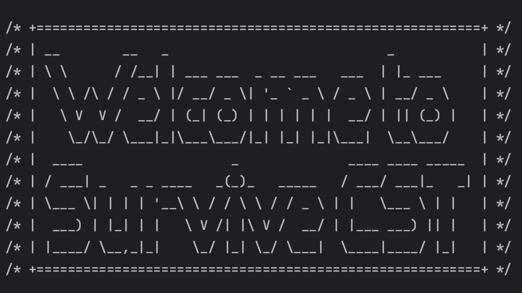
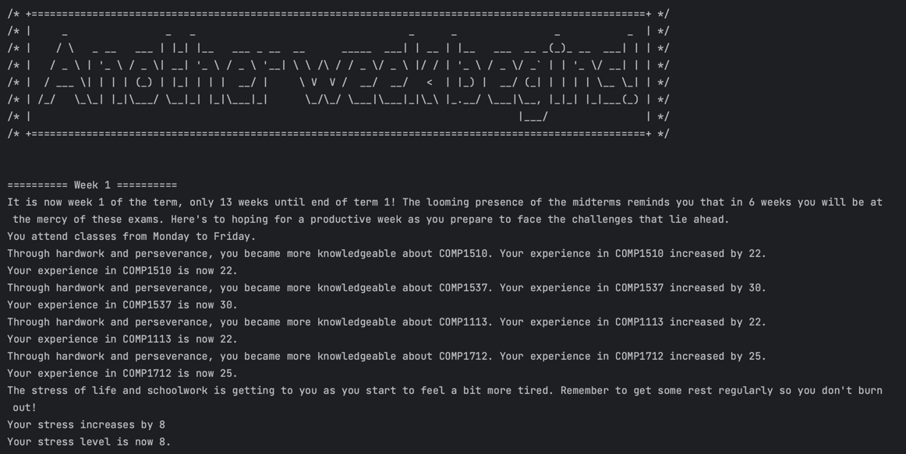
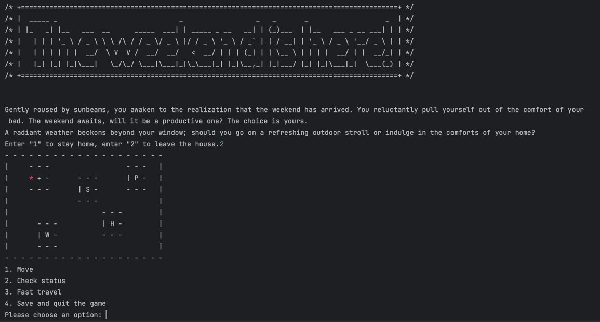

# Survive CST
by: Alice Huang (orangeepop), Yang Guo (YangGuo57 )

## About this game:
\
Survive CST is a trxt-based SUD simulation game in Python, where the player is a new student entering first year, first 
term of 
the CST 
program. The player needs to balance schoolwork, social life, work life, and sleep in order to succeed in this 
program (and maybe even get co-op). 

Each week, the player attends classes, and the player's relevant stats (such as experience in a subject, stress, etc)
may change. 

On the weekends, the player has free time to dedicate to resting, socializing, working a part time job, 
studying, and exploring the city, all of which may affect certain stats differently.

The player needs to pass both midterms and finals in order to remain in the program. If the player excels 
academically, the player may even get a co-op opportunity!

## Save and load
The game has a save and load function implemented with json to allow the player to come back 
to a saved game at a later time. 

## Unit tests
Over 200 unit tests were written for this project to ensure the game runs smoothly and is not prone to crashing or 
other unintended bugs. Almost all functions have been properly tested, with the exception of the functions at the top 
level of function calls. We decided these functions did not need to be tested since the helper functions that they call 
have 
already been thoroughly tested.